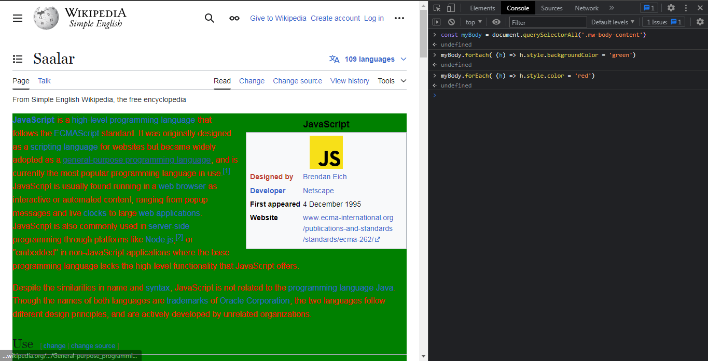

# HTML Collection

**Refer to 01.html in DOM folder for list-item class**

**document.getElementsByClassName('list-item')**

> ```HTMLCollection(3) [li.list-item, li.list-item, li.list-item]```

- const tempClassList = document.getElementsByClassName('list-item')  

> undefined

- tempClassList

> HTMLCollection(3) [li.list-item, li.list-item, li.list-item]

**when we have HTMLCollection (forEach) will not work so we convert HTMLCollection in Array with help of (Arry.from)** 

- Array.from(tempClassList)                 

> ``` (3) [li.list-item, li.list-item, li.list-item]0: li.list-item1: li.list-item2: li.list-itemlength: 3[[Prototype]]: Array(0)at: ƒ at()concat: ƒ concat()constructor: ƒ Array()copyWithin: ƒ copyWithin()entries: ƒ entries()every: ƒ every()fill: ƒ fill()filter: ƒ filter()find: ƒ find()findIndex: ƒ findIndex()findLast: ƒ findLast()findLastIndex: ƒ findLastIndex()flat: ƒ flat()flatMap: ƒ flatMap()forEach: ƒ forEach()includes: ƒ includes()indexOf: ƒ indexOf()join: ƒ join()keys: ƒ keys()lastIndexOf: ƒ lastIndexOf()length: 0map: ƒ map()pop: ƒ pop()push: ƒ push()reduce: ƒ reduce()reduceRight: ƒ reduceRight()reverse: ƒ reverse()shift: ƒ shift()slice: ƒ slice()some: ƒ some()sort: ƒ sort()splice: ƒ splice()toLocaleString: ƒ toLocaleString()toString: ƒ toString()unshift: ƒ unshift()values: ƒ values()Symbol(Symbol.iterator): ƒ values()Symbol(Symbol.unscopables): {at: true, copyWithin: true, entries: true, fill: true, find: true, …}[[Prototype]]: Object  ```

- const myConvertedArray = Array.from(tempClassList)  

> undefined

- myConvertedArray

> (3) [li.list-item, li.list-item, li.list-item]

- myConvertedArray.forEach(function(li){
    li.style.color = "orange"
})

> undefined


---


# Real word example on javascript wikipedia page 

**[Javascript-Wikipedia-URL](https://simple.wikipedia.org/wiki/JavaScript)**

- const h1 = document.querySelector('h1')     

> undefined

- h1

> ```<h1 id="firstHeading" class="firstHeading mw-first-heading">​…​</h1>​```

- h1.innerHTML    

> '<span class="mw-page-title-main">JavaScript</span>'

- h1.textContent  

> 'JavaScript'

- h1.innerText    

> 'JavaScript'

- h1.textContent = "Saalar"   

>  'Saalar'

- document.querySelectorAll('h2')

> NodeList(8) [h2.vector-pinnable-header-label, h2#Use, h2#Syntax, h2#Examples, h2#Differences_between_Java_and_Javascript, h2#Related_pages, h2#References, h2#Other_websites] 

- const allH2 = document.querySelectorAll('h2')   

>  undefined

- allH2[0].innerText              

> ''                             ``` command gives you empty string, many times first value not start with 0 ```

- allH2[1].innerText

> 'Use'



**Here mw-body-content is class name in document**

- document.querySelectorAll('.mw-body-content')

> NodeList [div#mw-content-text.mw-body-content]0: div#mw-content-text.mw-body-contentlength: 1[[Prototype]]: NodeList

- const myBody = document.querySelectorAll('.mw-body-content')    

> undefined

- myBody[0].innerText

> `JavaScript\n\nDesigned by\tBrendan Eich\nDeveloper\tNetscape\nFirst appeared\t4 December 1995\nWebsite\twww.ecma-international.org/publications-and-standards/standards/ecma-262/\n\nJavaScript is a high-level programming language that follows the ECMAScript standard. It was originally designed as a scripting language for websites but became widely adopted as a general-purpose programming language, and is currently the most popular programming language in use.[1] JavaScript is usually found running in a web browser as interactive or automated content, ranging from popup messages and live clocks to large web applications. JavaScript is also commonly used in server-side programming through platforms like Node.js,[2] or "embedded" in non-JavaScript applications where the base programming language lacks the high-level functionality that JavaScript offers.\n\nDespite the similarities in name and syntax, JavaScript is not related to the programming language Java. Though the names of both languages are trademarks of Oracle Corporation, the two languages follow different design principles, and are actively developed by unrelated organizations.\n\nUse[change | change source]\n\nJavaScript is typically inserted into HTML when used on the web, either directly in the file in an HTML tag, or linked to a separate file containing the script.\n\nJavaScript, as a full featured scripting language, can be used to provide functionality to a website. Examples include:\n\nUsing AJAX in order to load content without refreshing the website.\nChanging HTML through the Document Object Model\nChanging CSS\nValidating inputs of forms and sending them.\nTracking users as they move throughout the website.\nFrameworks[change | change source]\n\nA majority of websites use what is known as a framework. Frameworks may allow programming to be easier as more predefined procedures are defined within it. Such a library is jQuery.\n\nVideo Games[change | change source]\n\nJavaScript can be used to create and run video games in the browser. The modern web has quickly become a viable platform for creating and distributing high-quality games. With modern web technologies and a recent browser, it’s entirely possible to make stunning, top-notch games for the web. JavaScript is blazing fast in modern browsers and getting faster all the time. You can use its power to write the code for your game or look at using technologies like Emscripten or Asm.js to easily port your existing games.[3]\n\nThere are also many widely adopted game engines that you can use to develop games with JavaScript and HTML5. Some popular ones include Three.js, Pixi.js, Phaser, Babylon.js, Matter.js, and PlayCanvas. These game engines provide a range of features and tools to help you create sophisticated 2D and 3D graphics without relying on third-party plugins.[4]\n\nBeyond web browsers[change | change source]\n\nJavaScript is also used outside of web browsers. As a scripting language, JavaScript can be used to define the behaviour of applications such as extensions in GNOME Shell.\n\nIn addition, there are runtime environments for running JavaScript as a server side programming language. Such an environment is Node.js.\n\nElectron is a framework which allows graphical applications to be made with web technologies, by running on the Chromium browser and Node.js.\n\nSyntax[change | change source]\n\nA JavaScript program is made of a collection of instructions called "statements". A semicolon marks the end of a statement, and allows multiple statements to be placed on the same line. However, it is typical to write each statement on its own line to keep a program file readable.\n\nVariables can be defined in several ways. In an older version named "ES5", variables are defined using the var keyword.[5] In the newer versions after ES5, variables can be defined using const for constant variables and let for local variables.[6][7] The value of constant variables cannot be re-declared or reassigned. Variables assigned using const or let are contained within blocks, while variables assigned using var are contained within functions.\n\n// ES5\n\nvar x = 1;\n\n\n\n// ES6+\n\nconst y = 10; // Cannot be reassigned\n\nlet t = 5; // Can be reassigned\n\nExamples[change | change source]\n\nThe script below prints "Example" on the screen. The lines that start with // are comments, which are used to describe the actions of the program.[8]\n\nfunction sayHi() {\n    let name = prompt("What's your name?"); \n    // This name is saved to a variable\n    \n    alert("Hello " + name);\n    // Whatever the name is, the browser alerts "Hello (name)"\n}\n\nsayHi(); // Runs the function sayHi\n\n/*  This is also a comment,\n    but it can span multiple lines.\n*/\n\n\nThe code above alerts "Hello " + name.\n\nIf you want to put JavaScript in your HTML, you put it between an opening \x3Cscript> and closing \x3C/script> tag. These tags mean that whatever is between them is a script and not text to be put onto the web page. The script below inserts the numbers 1 through 10 at the bottom of a webpage:\n\n<!DOCTYPE html>\n<head>\n    <title>Example page</title>\n    \x3Cscript> // This is the script tag\n\n    for (let counter = 1; counter <= 10; counter++) {\n        document.body.innerHTML = document.body.innerHTML + counter + "<br>";\n        \n        /*\n            This puts the number, then a new line element (<br>),\n            at the end of the web page.\n        */\n        \n    }\n\n    // End javascript:\n    \x3C/script>\n</head>\n<body></body>\n\n\nThe for() loop makes whatever code is between the { and the } happen more than one time. In this case, it keeps looping until numOfTimesAround is equal to 10, then it stops. This means it equals ten. It's a bit confusing at first, but it works.\n\nDifferences between Java and Javascript[change | change source]\nIn Java, to define a variable, you have to say what type of variable it is: a number, a word, a letter, or more. In JavaScript, this is not necessary.\nIn JavaScript, functions are stored as variables (unlike Java). This makes the following code okay in JavaScript:\nfunction sayHi() {\n    alert("Hi!");\n}\n\nsayBye = function() {\n    alert("Bye!");\n}\n\nsayHi();\nsayBye();\n\nJavaScript is interpreted, but Java, in most cases, must be compiled. This means that JavaScript needs to be run by another computer program (an interpreter), but finished Java can be run as its own program.\nRelated pages[change | change source]\nHTML\nAjax (programming)\nJava (programming language)\nTypeScript\nReferences[change | change source]\n↑ "Stack Overflow Developer Survey 2021". Stack Overflow. 2021-08-01. Archived from the original on 2022-04-13. Retrieved 2022-04-18.\n↑ "Server-Side Javascript: Back With a Vengeance". ReadWrite. 2009-12-17. Retrieved 2020-03-11.\n↑ "Introduction to game development for the Web - Game development | MDN". developer.mozilla.org. 2023-04-14. Retrieved 2023-06-04.\n↑ Eseme, Solomon (2022-11-21). "Top 6 JavaScript and HTML5 game engines". LogRocket Blog. Retrieved 2023-06-04.\n↑ "var". MDN Web Docs. Retrieved 2018-03-24.\n↑ "const". MDN Web Docs. Retrieved 2018-03-24.\n↑ "let". MDN Web Docs. Retrieved 2018-03-24.\n↑ "Javascript Tutorial - Comments".\nOther websites[change | change source]\nLearn JavaScript Archived 2012-07-16 at the Wayback Machine on the Mozilla Developer Center\nMozilla's Official Documentation on JavaScript\nhttps://mazharulislam.xyz/what-[permanent dead link]\nVideo - Firefox 2 and Javascript with Mozilla Corp and JavaScript creator Brendan Eich Archived 2007-09-27 at the Wayback Machine\nReferences for Core JavaScript versions: 1.5\nNew in JavaScript: 1.7 Archived 2009-03-08 at the Wayback Machine, 1.6 Archived 2008-06-28 at the Wayback Machine\nList of JavaScript releases: versions 1.0 - 1.7 Archived 2008-05-14 at the Wayback Machine\nBrendan's Roadmap Updates: JavaScript 1, 2, and in between Archived 2006-01-01 at the Wayback Machine - the author's blog entry\ncomp.lang.javascript FAQ Archived 2012-03-01 at the Wayback Machine Official FAQ for the comp.lang.javascript Usenet group\nRFC 4329, a document for the registration of media types related to ECMAScript and JavaScript. The current recommendations are "application/javascript" and "application/ecmascript", although neither is recognized by Internet Explorer.`

```
{
    myBody.forEach( function(h){
        h.style.color = 'green'
    })
}
```

> undefined

```
{
    myBody.forEach( function(h){
        h.style.color = 'green';
        h.style.backgroundColor = 'yellow';
        h.padding = '10px';
    })
}
```

> undefined

```
{
     myBody.forEach( function(h){
        h.style.color = 'green';
        h.style.backgroundColor = 'yellow';
        h.style.padding = '10px';
    })
}
```

> undefined